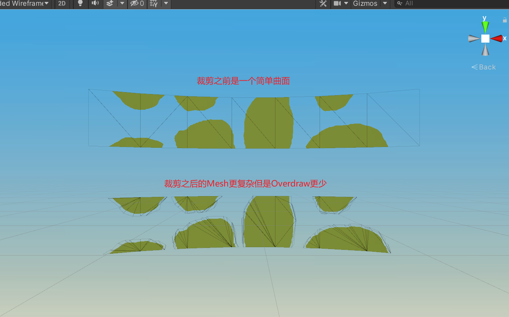

### 起因
Unity能裁剪Sprite的矩形变成Overdraw更少的多边形，
但是找遍全网都没有基于Mesh的透明裁剪，
于是就自己动手实现了这个工具。

### 原理
将Mesh上使用的贴图使用Unity内置的透明裁剪变成的多边形，
然后将这个多边形与原始Mesh的多边形做相交处理，
最后将相交重叠部分的多边形重新生成Mesh。

### 核心插件
Unity的内置裁剪函数SpriteUtility.GenerateOutline，
多边形库Clipper做相交运算，
三角化库LibTessDotNet生成Mesh。

### 使用方法
给Prefab挂上MeshTrimmer，设置参数
点击TrimMesh就能自动生成Overdraw更少的Mesh
